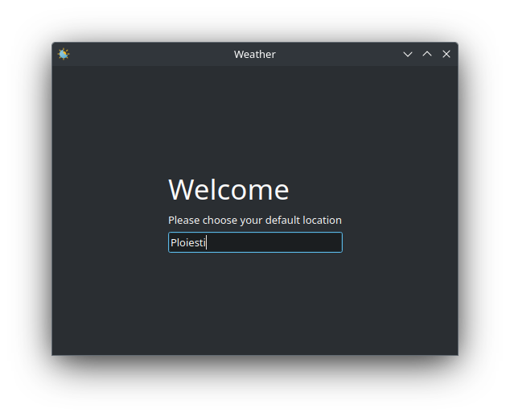
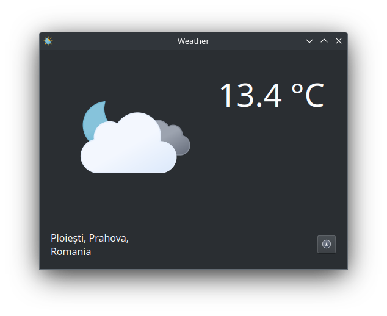

# Weather
Simple weather application




## Linux
Install requirements
```bash
sudo apt install build-essential cmake ninja-build qt6-base-dev qt6-svg-dev
```

Clone repository and build
```bash
git clone https://github.com/cipfge/weather
cd weather
mkdir build
cd build
cmake -G Ninja ..
ninja
```

## Windows

Install **MSVC** compiler by installing **Visual Studio Community** and [Qt6](https://www.qt.io/)

Clone repository and open project in **QtCreator**

## References
[Open-Meteo](https://open-meteo.com/)

[Open Street Map](https://www.openstreetmap.org/)
